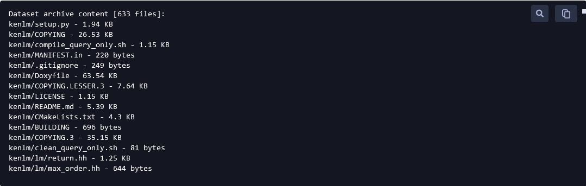
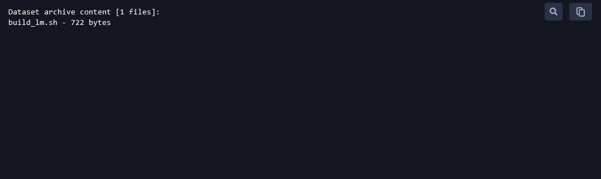
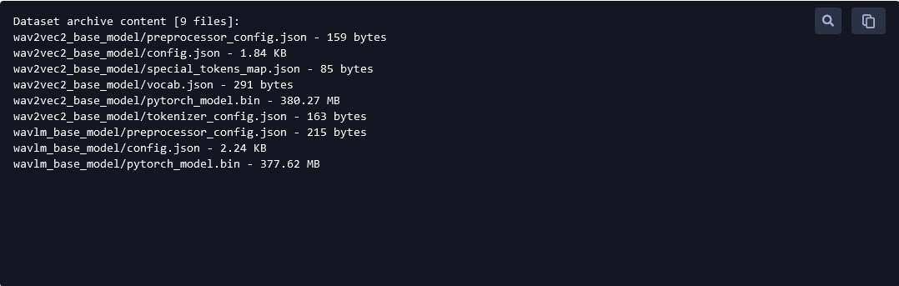

# Speech-to-Text with Kenlm Pipeline
A self-supervised speech-to-text pipeline that is finetuned on HuggingFace's wav2vec2 and wavlm pretrained models. The finetuned models produced from this pipeline is then evaluated with the use of `Kenlm` language model and beam search capability from the `pyctcdecode` libraries. This repository is centered around the ClearML MLOps Framework, but running the code on the local machine is also possible.  
  
## Introduction 

### Research Papers  
  
[wav2vec 2.0 Architecture](https://arxiv.org/abs/2006.11477) | [wavLM Architecture](https://arxiv.org/abs/2110.13900)   

### Methods of Executing the Code
There will be two methods of executing the code in this pipeline, they are:  
- [Executing code on local machine](#executing-code-on-local-machine)  
- [Executing code on ClearML](#executing-code-on-clearml)  
   
### Tasks in this pipeline   
The tasks in this pipeline are as follows:  
1. Data Preprocessing - [Local](#data-preprocessing-on-local-machine) | [ClearML](#data-preprocessing-on-clearml)   
2. Building the language model using Kenlm - [Local](#building-the-language-model-using-kenlm-on-local-machine) | [ClearML](#building-the-language-model-using-kenlm-on-clearml)  
3. Finetuning the pretrained wav2vec2 and wavlm models from HuggingFace - [Local](#finetuning-the-pretrained-wav2vec2-and-wavlm-models-from-huggingface-on-local-machine) | [ClearML](#finetuning-the-pretrained-wav2vec2-and-wavlm-models-from-huggingface-on-clearml)  
4. Evaluation of the finetuned model with the Kenlm language model built - [Local](#evaluation-of-the-finetuned-model-with-the-kenlm-language-model-built-on-local-machine) | [ClearML](#evaluation-of-the-finetuned-model-with-the-kenlm-language-model-built-on-clearml)   
  
<br>  

## Project Organization  
There are **some folders that needs to be created by the user to store the datasets (audio and annotations) and the base models used. The instructions will be shown below in the repository structure on what needs to be created by the user**. You can get the base [wav2vec 2.0](https://huggingface.co/facebook/wav2vec2-base/tree/main) and [wavLM](https://huggingface.co/microsoft/wavlm-base/tree/main) models from the HuggingFace website. In this repository, librispeech data will be used as an example. You can get the librispeech dataset from [here](https://www.openslr.org/12).   

The repository structure will be as shown below:  
```
    .
    ├── docker-compose.yml      <--- the file used to build the docker container which will make use of the Dockerfile
    ├── Dockerfile              <--- storing all the dependencies required to build the container, including requirements.txt, building packages from source etc.
    ├── img                     <--- a directory of the images just for the readme
    ├── kenlm
    │   └── kenlm               <--- a folder with all the kenlm dependencies
    ├── LICENSE
    ├── README.md               
    ├── requirements.txt        <--- all the dependencies that are required to pip install
    └── tasks                   <--- main directory where all the execution of code takes place
        ├── preprocessing       <--- directory to store all the code (logic), also the directory where execution of code is done locally
        │   ├── datasets        <--- <CREATE THIS FOLDER>
        │   │    └── <PUT YOUR DATASETS HERE>
        │   ├── build_lm.py             
        │   ├── build_lm.sh
        │   ├── data_preprocessing.py
        │   ├── evaluation_with_lm.py
        │   ├── finetuning.py
        │   ├── lm_src
        │   │   └── build_lm.sh
        │   ├── root (don't have when cloned)   <--- the directory that will be generated when you execute the pipeline codes
        │   │   ├── lm
        │   │   │   └── <your generated language model in arpa format>
        │   │   ├── <your saved finetuned models for the dataset, checkpoint, processor and saved_model>
        │   │   │   └── <finetuned model 1 ...>
        │   │   │       ├── ckpt
        │   │   │       │   └── <your checkpoint files>
        │   │   │       ├── processor
        │   │   │       │   └── <your processor files>
        │   │   │       └── saved_model
        │   │   │           └── <your saved model files>
        │   │   └── pkl             <--- storing your preprocessed pkl files
        │   │       └── <your train, dev and test pkl files>
        │   └── root_base_model     <--- <PUT YOUR BASE MODELS HERE>
        │       ├── wav2vec2_base_model   <--- EXAMPLE 1
        │       │   └── <PUT THE BASE MODEL 1 FILES HERE>
        │       └── wavlm_base_model      <--- EXAMPLE 2
        │           └── <PUT THE BASE MODEL 2 FILES HERE>
        ├── scripts
        │   ├── task_build_lm
        │   │   └── librispeech.sh
        │   ├── task_data_preprocessing
        │   │   └── librispeech.sh
        │   ├── task_evaluation_with_lm
        │   │   ├── librispeech_wav2vec2.sh
        │   │   └── librispeech_wavlm.sh
        │   └── task_finetuning
        │       ├── librispeech_from_scratch_wav2vec2.sh
        │       ├── librispeech_from_scratch_wavlm.sh
        │       ├── librispeech_resume_wav2vec2.sh
        │       └── librispeech_resume_wavlm.sh
        ├── task_build_lm.py
        ├── task_data_preprocessing.py
        ├── task_evaluation_with_lm.py
        └── task_finetuning.py

```

The structure of the dataset required by user will be shown below, ensure that there is a manifest file, each for train, dev and test dataset:  
```
datasets
├── train
│   ├── <your audio files (audio files can be in nested folder form also)>       
│   └── train_manifest.json
├── dev
│   ├── <your audio files (audio files can be in nested folder form also)>       
│   └── dev_manifest.json
└── test
    ├── <your audio files (audio files can be in nested folder form also)>       
    └── test_manifest.json
```

<br>

# Executing code on local machine
**The documentations below are for running the code using local machine, please go to the section on [Executing code on ClearML](#executing-code-on-clearml) if you want to run your code on ClearML**  

### Getting Started - Via Docker 
**Preferably, a Linux OS should be used**
1. Ensure that docker is installed in your computer
2. Clone this repository
```shell
git clone https://github.com/nicholasneo78/speech-to-text-with-kenlm-pipeline
```
3. Open the terminal and go to the root directory of this repository
4. Build the Dockerfile that is created in the repository using the docker-compose.yml file
```shell
docker-compose up --build -d
```
5. After building the docker image, check if the image is successfully built, by typing the following command
```shell
docker images
```
You should see the image `stt-with-kenlm-pipeline` with the tag `latest` in the list of docker images  
  
### Entering the docker image
1. To enter into the docker image to execute codes in the pipeline, execute this command
```shell
docker-compose run local bash
```
The codes are then ready to be executed inside the docker image, more information about executing each code will be discussed below.  

<br>   
   
## Data Preprocessing on Local Machine  
To preprocess the audio and the annotation data and converts the train, dev and test datasets into pickle files as required by the finetuning step. You can choose to generate the pickle datasets from scratch or from a manifest file. Check out [this repository](https://github.com/nicholasneo78/manifest-preprocessing) to see how you can generate the manifest file from your dataset.     
    
#### Arguments  

*Generate from scratch*  
- `root_folder`: (str) the folder path where all the audio files and annotations are found (".wav", ".flac", etc.)  
- `pkl_filename`: (str) the directory where the pickle file is being generated  
- `audio_format`: (str) the audio format of the targeted audio files, currently, only single audio extension per root folder is supported   
  
*Generate from manifest*  
- `manifest_path`: (str) the path where the manifest file resides (".json" format)  
- `pkl_filename`: (str) the directory where the pickle file is being generated    

#### Return
Both classes returns the pandas DataFrame and the pickle filepath where the pickle file is generated from the preprocessing.  
   
#### Before executing the code
Before executing the code, check the script `speech-to-text-with-kenlm-pipeline/tasks/preprocessing/data_preprocessing.py`, go to the bottom of the code, after the `if __name__ == "__main__"` line, call the class, either `GeneratePickleFromScratch` or `GeneratePickleFromManifest` to do the data preprocessing, here is a code snippet to illustrate the data preprocessing step:  
  
*Generate from scratch*  
```python
generate_train_pkl = GeneratePickleFromScratch(root_folder='<YOUR_TRAIN_DATASET_ROOT_FOLDER>', 
                                               pkl_filename='./root/pkl/<YOUR_FILENAME_OF_THE_TRAIN_PICKLE_FILE_GENERATED>.pkl', 
                                               audio_format='.<THE_AUDIO_FORMAT_OF_THE_AUDIO_FILES>')

generate_dev_pkl = GeneratePickleFromScratch(root_folder='<YOUR_DEV_DATASET_ROOT_FOLDER>', 
                                             pkl_filename='./root/pkl/<YOUR_FILENAME_OF_THE_DEV_PICKLE_FILE_GENERATED>.pkl', 
                                             audio_format='.<THE_AUDIO_FORMAT_OF_THE_AUDIO_FILES>')

generate_test_pkl = GeneratePickleFromScratch(root_folder='<YOUR_TEST_DATASET_ROOT_FOLDER>', 
                                              pkl_filename='./root/pkl/<YOUR_FILENAME_OF_THE_TEST_PICKLE_FILE_GENERATED>.pkl', 
                                              audio_format='.<THE_AUDIO_FORMAT_OF_THE_AUDIO_FILES>')

train_df, train_pkl_path = generate_train_pkl()
dev_df, dev_pkl_path = generate_dev_pkl()
test_df, test_pkl_path = generate_test_pkl()
```  
   
*Generate from manifest*  
```python
generate_train_pkl = GeneratePickleFromManifest(manifest_path='<YOUR_TRAIN_DATASET_MANIFEST_JSON_FILE>', 
                                                pkl_filename='./root/pkl/<YOUR_FILENAME_OF_THE_TRAIN_PICKLE_FILE_GENERATED>.pkl')

generate_dev_pkl = GeneratePickleFromManifest(manifest_path='<YOUR_DEV_DATASET_MANIFEST_JSON_FILE>',
                                              pkl_filename='./root/pkl/<YOUR_FILENAME_OF_THE_DEV_PICKLE_FILE_GENERATED>.pkl')

generate_test_pkl = GeneratePickleFromManifest(manifest_path='<YOUR_TEST_DATASET_MANIFEST_JSON_FILE>',
                                               pkl_filename='./root/pkl/<YOUR_FILENAME_OF_THE_TEST_PICKLE_FILE_GENERATED>.pkl')

train_df, train_pkl_path = generate_train_pkl()
dev_df, dev_pkl_path = generate_dev_pkl()
test_df, test_pkl_path = generate_test_pkl()
```  
  
There will be an example of the code tested on the librispeech dataset in the python script.    

#### Executing the code
To execute the data preprocessing code, on the terminal, go to this repository and enter into the docker image (refer above for the command), inside the docker container, type the following command:  
```shell
cd /stt-with-kenlm-pipeline/tasks/preprocessing
python3 data_preprocessing.py
```
<br>


## Building the language model using Kenlm on Local Machine 
To build a kenlm language model from the train and dev pickle files that were generated from the data preprocessing step. **Note: Do not pass in the test pickle file into building the language model as this will cause data leakage, causing inaccuracies in the evaluation phase.** The script will first load the train and dev pickle files, then will write all the annotations into a text file. It will then load the text file generated into the kenlm script to build the language model based on the train and dev dataset.  
  
#### Arguments  
- `df_train_filepath`: (str) the file path where the train pickle file is being generated    
- `df_dev_filepath`: (str) the file path where the dev pickle file is being generated   
- `script_path`: (str) script path to execute the building of the kenlm language model .arpa file  
- `root_path`: the root path where the kenlm directory and its packages resides  
- `txt_filepath`: (str) the text file path generated when the train and dev pickle file annotations are being consolidated    
- `n_grams`: (str) number of grams you want for the language model    
- `dataset_name`: (str) the name you want to give for the language model built    

#### Return
The filepath of the language model built.  
   
#### Before executing the code
Before executing the code, check the script `speech-to-text-with-kenlm-pipeline/tasks/preprocessing/build_lm.py`, go to the bottom of the code, after the `if __name__ == "__main__"` line, call the class `BuildLM` to build the Kenlm language model, here is a code snippet to illustrate the building of language model:   
   
```python
get_lm = BuildLM(df_train_filepath='./root/pkl/<YOUR_FILENAME_OF_THE_TRAIN_PICKLE_FILE_GENERATED>.pkl',
                 df_dev_filepath='./root/pkl/<YOUR_FILENAME_OF_THE_DEV_PICKLE_FILE_GENERATED>.pkl.pkl', 
                 script_path="./build_lm.sh", 
                 root_path="/stt_with_kenlm_pipeline/kenlm", 
                 txt_filepath="root/lm/<YOUR_TEXT_FILE_NAME>.txt", 
                 n_grams="<NUMBER_OF_GRAMS>", # preferably "5" 
                 dataset_name="<NAME OF THE DATASET>")

lm_path = get_lm()
```  
   
There will be an example of the code tested on the librispeech dataset in the python script.    

#### Executing the code
To execute the language model building code, on the terminal, go to this repository and enter into the docker image (refer above for the command), inside the docker container, type the following command:  
```shell
cd /stt-with-kenlm-pipeline/tasks/preprocessing
python3 build_lm.py
```
<br>

## Finetuning the pretrained wav2vec2 and wavlm models from HuggingFace on Local Machine
The code to finetune the pretrained wav2vec2 and wavlm models from HuggingFace. In this repository, for demonstration purpose, only the base wav2vec2 and base wavlm pretrained models are used, but feel free to add the larger wav2vec2 and wavlm models as the base pretrained model. This script also has the ability to check for the audio length distribution of the train dataset, so that you can remove the longer audio data to prevent out-of-memory issues. *This script can also do evaluation on the test dataset but with the absence of a language model. Hence, it is not encouraged to get the evaluation score here, but rather on the evaluation script discussed later.*    

#### Arguments  
*Get audio length distribution*  
- `train_pkl`: (str) the file path where the train pickle file is being generated 
- `dev_pkl`: (str) the file path where the dev pickle file is being generated  
- `test_pkl`: (str) the file path where the test pickle file is being generated    
- `processor_path`: (str) the path where the processor will be generated from the loaded pickle file
- `max_sample_length`: (int) the maximum audio sample length of the audio file that could be accepted before hitting an out-of-memory issue (NOT USED because this is just checking the audio distribution and not the actual finetuning) 
- `mode`: (str) a flag to set, whether you want finetuning or checking audio distribution mode  
<br>  

*Finetuning*  
- `train_pkl`: (str) the file path where the train pickle file is being generated 
- `dev_pkl`: (str) the file path where the dev pickle file is being generated  
- `test_pkl`: (str) the file path where the test pickle file is being generated 
- `input_processor_path`: (str) the path where the processor is being input for the finetuning 
- `input_checkpoint_path`: (str) the path where the checkpoint is being input for the finetuning
- `input_pretrained_model_path`: (str) the path where the saved model is being input for the finetuning 
- `output_processor_path`: the path where the processor is being output after the finetuning   
- `output_checkpoint_path`: (str) the path where the checkpoint is being output after the finetuning
- `output_saved_model_path`: (str) the path where the saved model is being output after the finetuning
- `max_sample_length`: (int) the maximum audio sample length of the audio file that could be accepted before hitting an out-of-memory issue
- `batch_size`: (int) the batch size used for the finetuning
- `epochs`: (int) the number of epochs used for the finetuning   
- `gradient_accumulation_steps`: (int) how many steps it accumulates before updating the gradient
- `save_steps`: (int) the steps interval before saving the checkpoint
- `eval_logging_steps`: (int) the steps interval before evaluation with the dev set
- `lr`: (float) learning rate used for the finetuning
- `weight_decay`: (float) weight decay used for the finetuning
- `warmup_steps`: (int) number of finetuning steps used with a lower learning rate for the model to adapt to finetuning
- `architecture`: (str) choose whether to finetune on wav2vec2 or wavlm architecture
- `finetune_from_scratch`: (boolean) whether to finetune from the pretrained base model or to resume finetuning from previous checkpoint steps
<br> 
  
*Evaluation*  
- `dev_pkl`: (str) the file path where the dev pickle file is being generated  
- `test_pkl`: (str) the file path where the test pickle file is being generated
- `processor_path`: (str) the path where the processor is being output from the finetuning step 
- `saved_model_path`: (str) the path where the saved model is being output after the finetuning   
- `architecture`: (str) choose whether to finetune on wav2vec2 or wavlm architecture
  
#### Return
*Get audio length distribution*   
None
  
*Finetuning*  
The output checkpoint path, output processor path, input pretrained model path and the output saved model path   
  
*Evaluation*   
None   


#### Before executing the code
Before executing the code, check the script `speech-to-text-with-kenlm-pipeline/tasks/preprocessing/finetuning.py`, go to the bottom of the code, after the `if __name__ == "__main__"` line, depending on your task, call the class `FinetuningPreparation` to get the audio length distribution, `Finetuning` to finetune the model and `Evaluation` to evaluate on the finetuned model. Here is a code snippet to illustrate the executed task:  
<br>  

*Get audio length distribution*  
```python
distribution = FinetuningPreparation(train_pkl='./root/pkl/<YOUR_FILENAME_OF_THE_TRAIN_PICKLE_FILE_GENERATED>.pkl',
                                     dev_pkl='./root/pkl/<YOUR_FILENAME_OF_THE_DEV_PICKLE_FILE_GENERATED>.pkl', 
                                     test_pkl='./root/pkl/<YOUR_FILENAME_OF_THE_TEST_PICKLE_FILE_GENERATED>.pkl',
                                     processor_path='./root/<PATH_WHERE_THE_PROCESSOR_RESIDES>', 
                                     max_sample_length=None, 
                                     mode='get_audio_length_distribution')

distribution()
```
<br>

*Finetuning*  
```python
finetune_model = Finetuning(train_pkl='./root/pkl/<YOUR_FILENAME_OF_THE_TRAIN_PICKLE_FILE_GENERATED>.pkl',
                            dev_pkl='./root/pkl/<YOUR_FILENAME_OF_THE_DEV_PICKLE_FILE_GENERATED>.pkl', 
                            test_pkl='./root/pkl/<YOUR_FILENAME_OF_THE_TEST_PICKLE_FILE_GENERATED>.pkl', 
                            input_processor_path='./root/<YOUR_INPUT_PROCESSOR_PATH>', 
                            input_checkpoint_path='./root/<YOUR_INPUT_CHECKPOINT_PATH>', 
                            input_pretrained_model_path='./root/<YOUR_INPUT_PRETRAINED_MODEL_PATH>',
                            output_processor_path='./root/<YOUR_OUTPUT_PROCESSOR_PATH>', 
                            output_checkpoint_path='./root/<YOUR_OUTPUT_CHECKPOINT_PATH>', 
                            output_saved_model_path='./root/<YOUR_OUTPUT_SAVED_MODEL_PATH>', 
                            max_sample_length=<YOUR_MAX_AUDIO_SAMPLE_LENGTH_NUMBER>, 
                            batch_size=<BATCH_SIZE>, 
                            epochs=<NUMBER_OF_EPOCHS>,
                            gradient_accumulation_steps=<NUMBER_OF_STEPS_TO_ACCUMULATE_BEFORE_UPDATING_GRADIENT>,
                            save_steps=<STEPS_INTERVAL_TO_UPDATE_MODEL_CHECKPOINT>,
                            eval_logging_steps=<STEPS_INTERVAL_FOR_EVALUATION_WITH_THE_DEV_SET>,
                            lr=<LEARNING_RATE>, 
                            weight_decay=<WEIGHT_DECAY>, 
                            warmup_steps=<WARMUP_STEPS>, 
                            architecture='<EITHER_wav2vec2_OR_wavlm>',
                            finetune_from_scratch=<EITHER_True_OR_False>)

output_ckpt_path, output_processor_path, input_pretrained_model_path, output_saved_model_path = finetune_model()
```
<br>

*Evaluation*  
```python
evaluation = Evaluation(dev_pkl='./root/pkl/<YOUR_FILENAME_OF_THE_DEV_PICKLE_FILE_GENERATED>.pkl', 
                        test_pkl='./root/pkl/<YOUR_FILENAME_OF_THE_TEST_PICKLE_FILE_GENERATED>.pkl',
                        processor_path='./root/<YOUR_OUTPUT_PROCESSOR_PATH>', 
                        saved_model_path='./root/<YOUR_OUTPUT_SAVED_MODEL_PATH>',
                        architecture='<EITHER_wav2vec2_OR_wavlm>')

evaluation()
```

There will be an example of the code tested on the librispeech dataset in the python script.   
  

#### Executing the code
To execute either the get audio distribution, finetuning or evaluation code, on the terminal, go to this repository and enter into the docker image (refer above for the command), inside the docker container, type the following command:  
```shell
cd /stt-with-kenlm-pipeline/tasks/preprocessing
python3 finetuning.py
```
<br>
  
## Evaluation of the finetuned model with the Kenlm language model built on Local Machine 
The code to evaluate the finetuned model with the use of the Kenlm language model built earlier.  
  
#### Arguments  
- `finetuned_model_path`: (str) the file path to get the output saved finetuned model
- `processor_path`: (str) the file path to get the output saved processor path   
- `lm_path`: (str) the file path of the kenlm .arpa language model 
- `test_data_path`: (str) the file path where the test pickle file is being generated
- `alpha`: (float) for decoding using language model - weight associated with the LMs probabilities. A weight of 0 means the LM has no effect
- `beta`: (float) for decoding using language model - weight associated with the number of words within the beam
- `architecture`: (str) choose whether to finetune on wav2vec2 or wavlm architecture  

#### Return
The WER using greedy search and the WER using beam search
  
#### Before executing the code
Before executing the code, check the script `speech-to-text-with-kenlm-pipeline/tasks/preprocessing/evaluation_with_lm.py`, go to the bottom of the code, after the `if __name__ == "__main__"` line, call the class `EvaluationWithLM`. Here is a code snippet to illustrate getting the WER for greedy and beam search:  
<br>  

#### Executing the code
```python
evaluation = EvaluationWithLM(finetuned_model_path='./root/<YOUR_OUTPUT_SAVED_MODEL_PATH>',
                              processor_path='./root/<YOUR_OUTPUT_PROCESSOR_PATH>',
                              lm_path='root/<YOUR_SAVED_KENLM_LANGUAGE_MODEL_PATH>.arpa', 
                              test_data_path='./root/pkl/<YOUR_FILENAME_OF_THE_TEST_PICKLE_FILE_GENERATED>.pkl', 
                              alpha=<ALPHA_VALUE>, 
                              beta=<BETA_VALUE>,
                              architecture='<EITHER_wav2vec2_OR_wavlm>')

greedy, beam = evaluation()
```

There will be an example of the code tested on the librispeech dataset in the python script.  

#### Executing the code
To execute the evaluation code, on the terminal, go to this repository and enter into the docker image (refer above for the command), inside the docker container, type the following command:  
```shell
cd /stt-with-kenlm-pipeline/tasks/preprocessing
python3 evaluation_with_lm.py
```
<br>

# Executing code on ClearML
**The documentations below are for running the code using ClearML, please go to the section on [Executing code on local machine](#executing-code-on-local-machine) if you want to run your code locally**  

### Getting Started - Install ClearML and boto3
To install ClearML and boto3, simply do a pip install in your environment:  
```shell
pip install clearml boto3
```

### Getting Started - Uploading the datasets and required model to S3 bucket
Upload the following items to your S3 bucket, either via AWS S3 cli or minio client and monitor it with ClearML dashboard:
- Your datasets   
- Kenlm (can be found in speech-to-text-with-kenlm-pipeline/kenlm/)  
- build_lm.sh bash script (can be found in speech-to-text-with-kenlm-pipeline/tasks/preprocessing/build_lm.sh)   
- A folder with the base models (wav2vec2 and wavlm)   
Check the artifacts on ClearML platform to check if the uploaded items are in the correct directories respectively, the correct directories are shown in the screenshots shown below (note the file structure of the folders as denoted by the '/' in the file paths):  
  
#### Datasets (Using librispeech as example)   
  
Similarly, for the dev data (dev/dev_manifest.json, dev/....) and test data (test/test_manifest.json, test/....)   
<br>
#### Kenlm  
  
<br>  
#### build_lm.sh bash script   
   
<br>  
#### Pretrained base models   
   
<br>  
  
## Data Preprocessing on ClearML  
To preprocess the audio and the annotation data and converts the train, dev and test datasets into pickle files as required by the finetuning step. **For ClearML version, only generating the pickle datasets from a manifest file is supported. If you want to generate from scratch, refer to the section on 'Executing code on local machine'.** Check out [this repository](https://github.com/nicholasneo78/manifest-preprocessing) to see how you can generate the manifest file from your dataset.     

#### Arguments
- `docker_image`: (str) the docker image used to load all the dependencies 
- `project_name`: (str) the clearml project name   
- `task_name`: (str) clearml task name     
- `dataset_name`: (str) name of the output dataset produced    
- `output_url`: (str) the clearml url that the task will be output at    
- `dataset_project`: (str) the clearml path which the datasets resides  
- `dataset_task_id`: (str) task id to retrieve the dataset  
- `manifest_path_train`: (str) path to retrieve the train manifest  
- `pkl_train`: (str) path to produce the train pickle file     
- `manifest_path_train`: (str) path to retrieve the dev manifest  
- `pkl_dev`: (str) path to produce the dev pickle file  
- `manifest_path_test`: (str) path to retrieve the test manifest  
- `pkl_test`: (str) path to produce the test pickle file   
- `additional_preprocessing`: (str) any other special cases of text preprocessing needed based on the annotations  
- `queue`: (str) the queue name for clearml

#### What is produced  
The train, dev and test datasets in the pickle format will be produced in the s3 bucket and shown in ClearML, depending on where you put your dataset_project location.

#### Before executing the code
Before executing the code, create a script identical to the example given on `speech-to-text-with-kenlm-pipeline/tasks/scripts/task_data_preprocessing/librispeech.sh` but with your own inputs. Here is a code snippet to illustrate the executed task:  
```shell
#!/bin/bash

python3 ../../task_data_preprocessing.py \
    --docker_image "nicholasneo78/stt_with_kenlm_pipeline:latest" \
    --project_name "<YOUR_PROJECT_NAME>" \
    --task_name "<YOUR_TASK_NAME>" \
    --dataset_name "<YOUR_DATASET_NAME>" \
    --output_url "<OUTPUT_URL_TO_YOUR_S3_BUCKET>" \
    --dataset_project "<PATH_TO_YOUR_CLEARML_DATASET>" \
    --dataset_task_id "<YOUR_DATASET_TASK_ID>" \
    --manifest_path_train "train/<YOUR_TRAIN_MANIFEST_FILENAME>.json" \
    --pkl_train "root/pkl/<YOUR_TRAIN_PKL_FILENAME>.pkl" \
    --manifest_path_dev "dev/<YOUR_DEV_MANIFEST_FILENAME>.json" \
    --pkl_dev "root/pkl/<YOUR_DEV_PKL_FILENAME>.pkl" \
    --manifest_path_test "test/<YOUR_TEST_MANIFEST_FILENAME>.json" \
    --pkl_test "root/pkl/<YOUR_TEST_PKL_FILENAME>.pkl" \
    --additional_preprocessing "general" \
    --queue "<YOUR_CLEARML_QUEUE>"
```
  
There will be an example of the code tested on the librispeech dataset in the bash script.   

#### Executing the code
To execute the code, on the terminal, go to this repository and type the following command:  
```shell
cd tasks/scripts/task_data_preprocessing
chmod 777 <YOUR_SCRIPT_FILE>.sh
./<YOUR_SCRIPT_FILE>.sh
```
<br>

## Building the language model using Kenlm on ClearML  
To build a kenlm language model from the train and dev pickle files that were generated from the data preprocessing step. **Note: Do not pass in the test pickle file into building the language model as this will cause data leakage, causing inaccuracies in the evaluation phase.** The script will first load the train and dev pickle files, then will write all the annotations into a text file. It will then load the text file generated into the kenlm script to build the language model based on the train and dev dataset.  

#### Arguments
- `docker_image`: (str) the docker image used to load all the dependencies 
- `project_name`: (str) the clearml project name   
- `task_name`: (str) clearml task name     
- `dataset_name`: (str) name of the output dataset produced    
- `output_url`: (str) the clearml url that the task will be output at    
- `dataset_project`: (str) the clearml path which the datasets resides   
- `dataset_pkl_task_id`: (str) task id to retrieve the pickle files   
- `script_task_id `: (str) task id to retrieve the script.sh uploaded earlier to the S3 bucket  
- `kenlm_id`: (str) task id to retrieve the kenlm files to build the language model   
- `train_pkl`: (str) path to get the train pkl file  
- `dev_pkl`: (str) path to get the dev pkl file   
- `script_path`: (str) filename of building the kenlm language model   
- `txt_filepath`: (str) path to get the text file with all the words from train and dev set   
- `n_grams`: (str) number of grams for the language model   
- `dataset_name_`: (str) the name of the dataset   
- `queue`: (str) the queue name for clearml   

#### What is produced  
The n-gram kenlm language model arpa file will be produced in the s3 bucket and shown in ClearML, depending on the defined n and where you put your dataset_project location.

#### Before executing the code
Before executing the code, create a script identical to the example given on `speech-to-text-with-kenlm-pipeline/tasks/scripts/task_build_lm/libirspeech.sh` but with your own inputs. Here is a code snippet to illustrate the executed task:  
```shell
#!/bin/bash

python3 ../../task_build_lm.py \
    --docker_image "nicholasneo78/stt_with_kenlm_pipeline:latest" \
    --project_name "<YOUR_PROJECT_NAME>" \
    --task_name "<YOUR_TASK_NAME>" \
    --dataset_name "<YOUR_DATASET_NAME>" \
    --output_url "<OUTPUT_URL_TO_YOUR_S3_BUCKET>" \
    --dataset_project "<PATH_TO_YOUR_CLEARML_DATASET>" \
    --dataset_pkl_task_id "<YOUR_DATASET_PKL_TASK_ID>" \
    --script_task_id "<YOUR_SCRIPT_TASK_ID>" \
    --kenlm_id "<YOUR_KENLM_TASK_ID>" \
    --train_pkl "pkl/<YOUR_TRAIN_PKL_FILENAME>.pkl" \
    --dev_pkl "pkl/<YOUR_DEV_PKL_FILENAME>.pkl" \
    --script_path "build_lm.sh" \
    --txt_filepath "root/lm/<YOUR_TEXT_FILENAME_TO_GET_ALL_WORDS_FROM_TRAIN_AND_DEV_SET>.txt" \
    --n_grams "<NUMBER_OF_GRAMS_SPECIFIED>" \
    --dataset_name_ "<YOUR_DATASET_NAME>" \
    --queue "<YOUR_CLEARML_QUEUE>"
```
  
There will be an example of the code tested on the librispeech dataset in the bash script.   

#### Executing the code
To execute the code, on the terminal, go to this repository and type the following command:  
```shell
cd tasks/scripts/task_build_lm
chmod 777 <YOUR_SCRIPT_FILE>.sh
./<YOUR_SCRIPT_FILE>.sh
```
<br>

## Finetuning the pretrained wav2vec2 and wavlm models from HuggingFace on ClearML   
The code to finetune the pretrained wav2vec2 and wavlm models from HuggingFace. In this repository, for demonstration purpose, only the base wav2vec2 and base wavlm pretrained models are used, but feel free to add the larger wav2vec2 and wavlm models as the base pretrained model. This script also has the ability to check for the audio length distribution of the train dataset, so that you can remove the longer audio data to prevent out-of-memory issues. *This script can also do evaluation on the test dataset but with the absence of a language model. Hence, it is not encouraged to get the evaluation score here, but rather on the evaluation script discussed later.*  

#### Arguments
- `docker_image`: (str) the docker image used to load all the dependencies 
- `project_name`: (str) the clearml project name   
- `task_name`: (str) clearml task name     
- `dataset_name`: (str) name of the output dataset produced    
- `output_url`: (str) the clearml url that the task will be output at    
- `dataset_project`: (str) the clearml path which the datasets resides   
- `dataset_pkl_task_id`: (str) task id to retrieve the pickle files   
- `dataset_pretrained_task_id`: (str) task id to retrieve the pretrained/finetuned model
- `train_pkl`: (str) path to get the train pkl file  
- `dev_pkl`: (str) path to get the dev pkl file  
- `test_pkl`: (str) path to get the test pkl file   
- `input_processor_path`: (str) path to retrieve the processor    
- `input_checkpoint_path`: (str) path to retrieve the checkpoint   
- `input_pretrained_model_path`: (str) path to retrieve the pretrained/finetuned model   
- `output_processor_path`: (str) path to output the processor   
- `output_checkpoint_path`: (str) path to output the checkpoint    
- `output_saved_model_path`: (str) path to output the pretrained/finetuned model   
- `max_sample_length`: (int) get the maximum sample length of the audio   
- `batch_size`: (int) batch size   
- `epochs`: (int) epochs    
- `gradient_accumulation_steps`: (int) how many steps it accumulates before updating the gradient
- `save_steps`: (int) the steps interval before saving the checkpoint
- `eval_logging_steps`: (int) the steps interval before evaluation with the dev set   
- `lr`: (float) learning rate   
- `weight_decay`: (float) weight decay   
- `warmup_steps`: (int) number of steps for warmup   
- `architecture`: (str) model based on wav2ve2 or wavlm   
- `finetune_from_scratch`: (boolean) finetune model either from scratch or pre-existing finetuned model   
- `queue`: (str) the queue name for clearml   

#### What is produced  
The finetuned model will be produced in the s3 bucket and shown in ClearML, depending on the defined n and where you put your dataset_project location.   

#### Before executing the code
Before executing the code, create a script identical to the example given on `speech-to-text-with-kenlm-pipeline/tasks/scripts/task_fientuning/librispeech_from_scratch_wav2vec2.sh` or `speech-to-text-with-kenlm-pipeline/tasks/scripts/task_fientuning/librispeech_resume_wav2vec2.sh` but with your own inputs. Here is a code snippet to illustrate the executed task:   

*Finetuning the pretrained model (from scratch)*   
```shell
#!/bin/bash

python3 ../../task_finetuning.py \
    --docker_image "nicholasneo78/stt_with_kenlm_pipeline:latest" \
    --project_name "<YOUR_PROJECT_NAME>" \
    --task_name "<YOUR_TASK_NAME>" \
    --dataset_name "<YOUR_DATASET_NAME>" \
    --output_url "<OUTPUT_URL_TO_YOUR_S3_BUCKET>" \
    --dataset_project "<PATH_TO_YOUR_CLEARML_DATASET>" \
    --dataset_pkl_task_id "<YOUR_DATASET_PKL_TASK_ID>" \
    --dataset_pretrained_task_id "<YOUR_PRETRAINED_WAV2VEC2_OR_WAVLM_MODEL>" \
    --train_pkl "pkl/<YOUR_TRAIN_PKL_FILENAME>.pkl" \
    --dev_pkl "pkl/<YOUR_DEV_PKL_FILENAME>.pkl" \
    --test_pkl "pkl/<YOUR_TEST_PKL_FILENAME>.pkl" \
    --input_processor_path "root/<YOUR_INPUT_PROCESSOR_PATH>" \
    --input_checkpoint_path "root/<YOUR_INPUT_CHECKPOINT_PATH>" \
    --input_pretrained_model_path "root/<YOUR_INPUT_PRETRAINED_MODEL_PATH>" \
    --output_processor_path "root/<YOUR_OUTPUT_PROCESSOR_PATH>" \
    --output_checkpoint_path "root/<YOUR_OUTPUT_CHECKPOINT_PATH>" \
    --output_saved_model_path "root/<YOUR_OUTPUT_SAVED_MODEL_PATH>" \
    --max_sample_length <YOUR_MAX_AUDIO_SAMPLE_LENGTH_NUMBER> \
    --batch_size <BATCH_SIZE> \
    --epochs <NUMBER_OF_EPOCHS> \
    --gradient_accumulation_steps <NUMBER_OF_STEPS_TO_ACCUMULATE_BEFORE_UPDATING_GRADIENT> \
    --save_steps <STEPS_INTERVAL_TO_UPDATE_MODEL_CHECKPOINT> \
    --eval_logging_steps <STEPS_INTERVAL_FOR_EVALUATION_WITH_THE_DEV_SET> \
    --lr <LEARNING_RATE> \
    --weight_decay <WEIGHT_DECAY> \
    --warmup_steps <WARMUP_STEPS> \
    --architecture "<EITHER_wav2vec2_OR_wavlm>" \
    --queue 'YOUR_CLEARML_QUEUE' \
    --finetune_from_scratch 
```
   
*Finetuning the existing finetuned model (resume finetuning)*   
```shell
#!/bin/bash

python3 ../../task_finetuning.py \
    --docker_image "nicholasneo78/stt_with_kenlm_pipeline:latest" \
    --project_name "<YOUR_PROJECT_NAME>" \
    --task_name "<YOUR_TASK_NAME>" \
    --dataset_name "<YOUR_DATASET_NAME>" \
    --output_url "<OUTPUT_URL_TO_YOUR_S3_BUCKET>" \
    --dataset_project "<PATH_TO_YOUR_CLEARML_DATASET>" \
    --dataset_pkl_task_id "<YOUR_DATASET_PKL_TASK_ID>" \
    --dataset_pretrained_task_id "<YOUR_PRETRAINED_WAV2VEC2_OR_WAVLM_MODEL>" \
    --train_pkl "pkl/<YOUR_TRAIN_PKL_FILENAME>.pkl" \
    --dev_pkl "pkl/<YOUR_DEV_PKL_FILENAME>.pkl" \
    --test_pkl "pkl/<YOUR_TEST_PKL_FILENAME>.pkl" \
    --input_processor_path "<YOUR_INPUT_PROCESSOR_PATH>" \
    --input_checkpoint_path "<YOUR_INPUT_CHECKPOINT_PATH>" \
    --input_pretrained_model_path "<YOUR_INPUT_PRETRAINED_MODEL_PATH>" \
    --output_processor_path "root/<YOUR_OUTPUT_PROCESSOR_PATH>" \
    --output_checkpoint_path "root/<YOUR_OUTPUT_CHECKPOINT_PATH>" \
    --output_saved_model_path "root/<YOUR_OUTPUT_SAVED_MODEL_PATH>" \
    --max_sample_length <YOUR_MAX_AUDIO_SAMPLE_LENGTH_NUMBER> \
    --batch_size <BATCH_SIZE> \
    --epochs <NUMBER_OF_EPOCHS> \
    --gradient_accumulation_steps <NUMBER_OF_STEPS_TO_ACCUMULATE_BEFORE_UPDATING_GRADIENT> \
    --save_steps <STEPS_INTERVAL_TO_UPDATE_MODEL_CHECKPOINT> \
    --eval_logging_steps <STEPS_INTERVAL_FOR_EVALUATION_WITH_THE_DEV_SET> \
    --lr <LEARNING_RATE> \
    --weight_decay <WEIGHT_DECAY> \
    --warmup_steps <WARMUP_STEPS> \
    --architecture "<EITHER_wav2vec2_OR_wavlm>" \
    --queue 'YOUR_CLEARML_QUEUE' \
```
  
There will be an example of the code tested on the librispeech dataset in the bash script.   

#### Executing the code
To execute the code, on the terminal, go to this repository and type the following command:  
```shell
cd tasks/scripts/task_finetuning
chmod 777 <YOUR_SCRIPT_FILE>.sh
./<YOUR_SCRIPT_FILE>.sh
```
<br>

## Evaluation of the finetuned model with the Kenlm language model built on ClearML   
The code to evaluate the finetuned model with the use of the Kenlm language model built earlier.  
  
#### Arguments  
- `docker_image`: (str) the docker image used to load all the dependencies 
- `project_name`: (str) the clearml project name   
- `task_name`: (str) clearml task name     
- `output_url`: (str) the clearml url that the task will be output at     
- `dataset_pkl_task_id`: (str) task id to retrieve the pickle files   
- `dataset_finetuned_task_id`: (str) task id to retrieve the finetuned model  
- `lm_id`: (str) task id to retrieve the kenlm language model   
- `test_pkl`: (str) path to get the test pkl file   
- `finetuned_model_path`: (str) the file path to get the output saved finetuned model  
- `input_processor_path`: (str) path to get the processor  
- `lm_path`: (str) path to get the language model   
- `alpha`: (float) for decoding using language model - weight associated with the LMs probabilities. A weight of 0 means the LM has no effect   
- `beta`: (float) for decoding using language model - weight associated with the number of words within the beam  
- `architecture`: (str) model based on wav2ve2 or wavlm   
- `queue`: (str) the queue name for clearml

#### What is produced  
No items in S3 bucket are uploaded. The WER (greedy and beam) will be shown on the ClearML console.  

#### Before executing the code
Before executing the code, create a script identical to the example given on `speech-to-text-with-kenlm-pipeline/tasks/scripts/task_evaluation_with_lm/librispeech_wav2vec2.sh` but with your own inputs. Here is a code snippet to illustrate the executed task:   

```shell
#!/bin/bash

python3 ../../task_evaluation_with_lm.py \
    --docker_image "nicholasneo78/stt_with_kenlm_pipeline:latest" \
    --project_name "<YOUR_PROJECT_NAME>" \
    --task_name "<YOUR_TASK_NAME>" \
    --dataset_name "<YOUR_DATASET_NAME>" \
    --output_url "<OUTPUT_URL_TO_YOUR_S3_BUCKET>" \
    --dataset_pkl_task_id "<YOUR_DATASET_PKL_TASK_ID>" \
    --dataset_finetuned_task_id "<YOUR_FINETUNED_MODEL_TASK_ID>" \
    --lm_id "<YOUR_BUILT_KENLM_LANGUAGE_MODEL_TASK_ID>" \
    --train_pkl "pkl/<YOUR_TEST_PKL_FILENAME>.pkl" \
    --finetuned_model_path "<YOUR_FINETUNED_MODEL_PATH>" \
    --input_processor_path "<YOUR_PROCESSOR_PATH>" \
    --lm_path "lm/<YOUR_KENLM_LANGUAGE_MODEL_FILENAME>.arpa" \
    --alpha <ALPHA> \
    --beta <BETA> \
    --architecture "<EITHER_wav2vec2_OR_wavlm>" \
    --queue "<YOUR_CLEARML_QUEUE>"
````
  
There will be an example of the code tested on the librispeech dataset in the bash script.   

#### Executing the code
To execute the code, on the terminal, go to this repository and type the following command:  
```shell
cd tasks/scripts/task_evaluation_with_lm
chmod 777 <YOUR_SCRIPT_FILE>.sh
./<YOUR_SCRIPT_FILE>.sh
```
<br>
